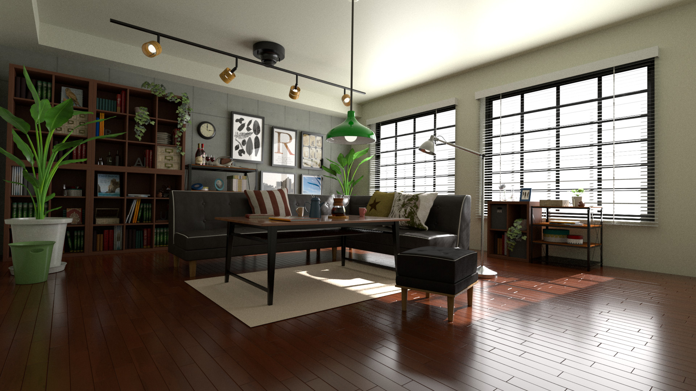

# 概要
ライトエリアの設定とレンダリング結果の画像を載せました。

AOVの設定は一部Samplingの未対応しています。
他はレンダリング時間かかる関係は後日対応します。

# 環境
- Maya 2023
   - ライティングとレンダリング

# file
- [Maya2023バイナリファイル](my_0703_Chap04_Room_Start.0001.mb)

# レンダリング画像
- Maya レンダリング
