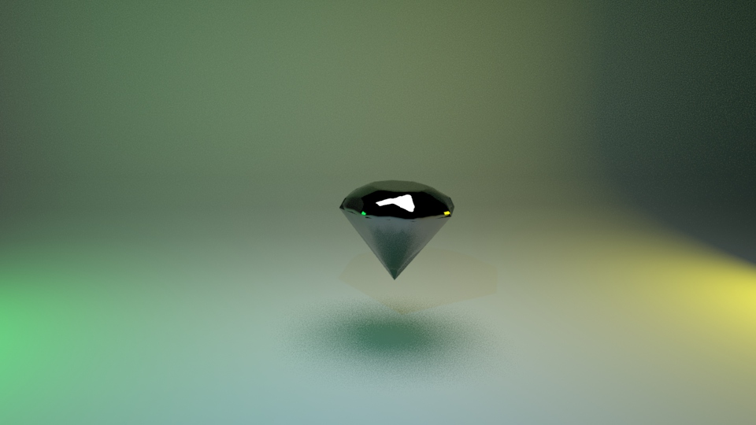

# 概要
マテリアル設定はZBrushで行い、  
ライトエリアの設定とレンダリング結果の画像を載せました。

# 環境
- Maya 2023
   - ライティングとレンダリング
- ZBrush 2023
   - ZModelerでモデリング

# file
- [Maya2023バイナリファイル](230702_diamond.mb)
- [ZBrushファイル](230702_diamond_05_material.zpr)

# レンダリング画像
