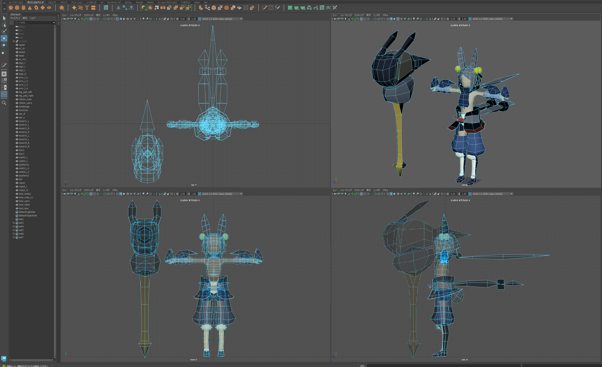

# 概要
ローポリゴンキャラクタ制作
- Mayaトレーニングブック第4版のサンプル制作

# 学習内容
1. ローポリゴンのモデリングを1から行う

# 環境
- Maya 2023

# maya ascii file
[my_EX_Chap01_03_23_parts_complete.ma](my_EX_Chap01_03_23_parts_complete.ma)

# スクリーンショット

